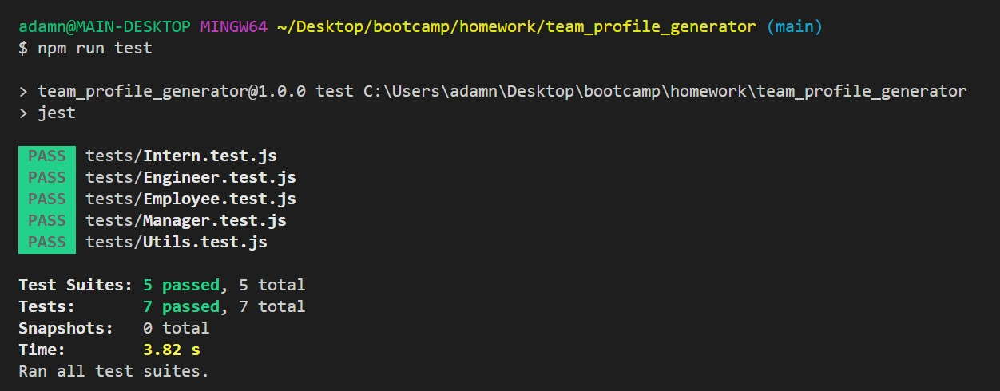
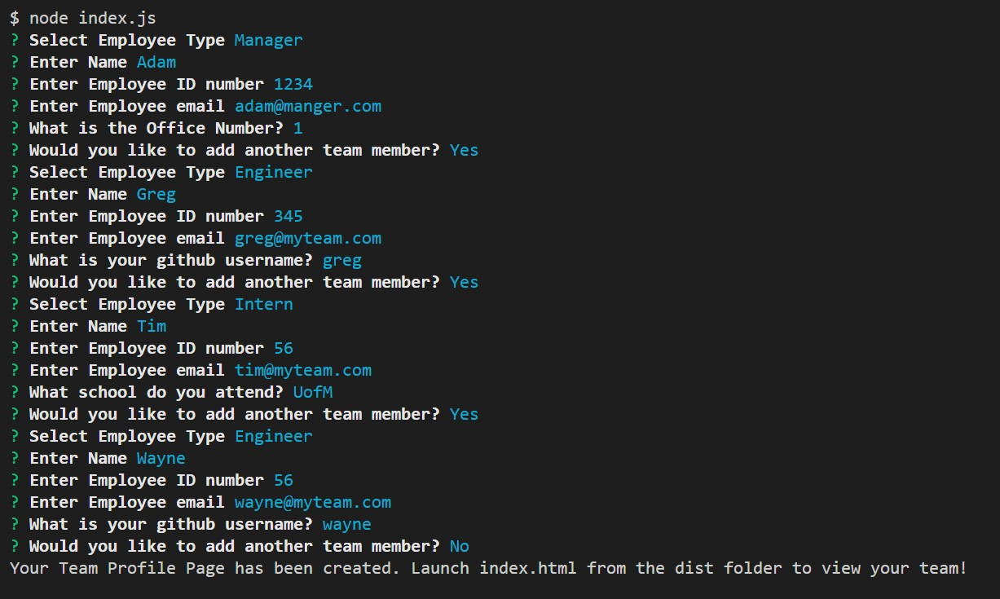
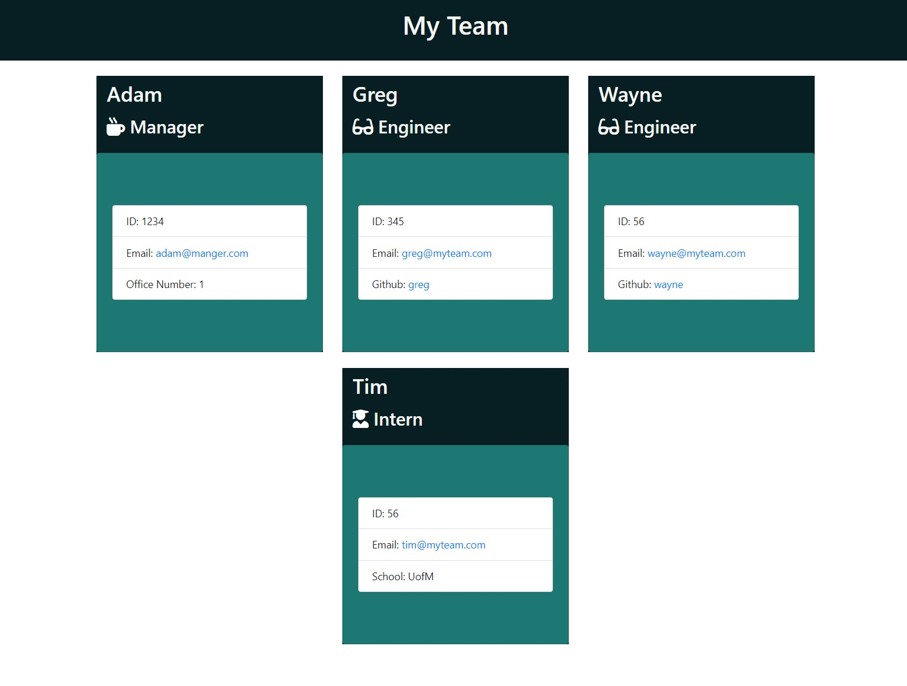

# Team Profile Generator 

## Description

Create a team profile web page with this simple and easy to use node team profile generator. Enter in your employee information including Name, Email, ID, Role and Special attribute and the application will create a professional looking web page displaying your team member information. 

## How to use
To use this Team Profile Generator simply launch via the command line in the directory to which you stored the downloaded files. Type in node index.js and follow the prompts to fill out the respective content sections. Check out the walk through video link below for more information, or have a look at the screenshots. 

## Github Repo Link
https://github.com/adamnatrop/team_profile_generator

## Walkthrough Video Link

Click on the link to watch a walkthrough video on how to use the Team Profile Generator

https://vimeo.com/533792732/32a6bc03ac

## Screenshots 

Team Profile Generator Passed Tests

Launch node index.js and Fill out the prompts

Once everything is filled out and your html team profile pages is created

